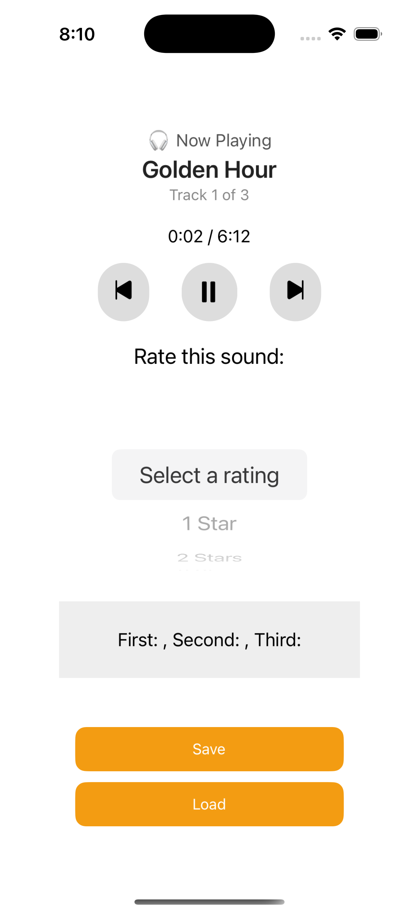

# Audio Rating App 🎧



### 🎧 Playlist Previews

- 🔊 [Golden Hour](https://www.soundhelix.com/examples/mp3/SoundHelix-Song-1.mp3)
- 🔊 [Dream Sequence](https://www.soundhelix.com/examples/mp3/SoundHelix-Song-2.mp3)
- 🔊 [Cosmic Flow](https://www.soundhelix.com/examples/mp3/SoundHelix-Song-3.mp3)

## Features

- 🎵 Audio playback using `expo-av`
- ⏯️ Play, pause, skip forward, and skip backward
- 🧠 Ratings stored locally with `AsyncStorage`
- 📋 Three unique tracks:
  - Golden Hour
  - Dream Sequence
  - Cosmic Flow
- ⭐ 5-star rating picker for each track
- 🕒 Real-time playback timer
- 📱 Simple, clean user interface with React Native components

## Screens
- **Now Playing**: Displays current track title, progress, and status
- **Controls**: Play/Pause, Next, and Previous buttons
- **Picker**: Single picker dynamically shown for the track
- **Save/Load**: Buttons to store and retrieve ratings locally

## Setup Instructions
1. Clone the repo or download the project folder.
2. Install dependencies:
   ```bash
   npm install
   ```
3. Run the project with Expo:
   ```bash
   npx expo start
   ```

## Dependencies
- `react-native`
- `@react-native-picker/picker`
- `@react-native-async-storage/async-storage`
- `expo-av`
- `@expo/vector-icons`

## Author
Created for a mobile development course assignment.


